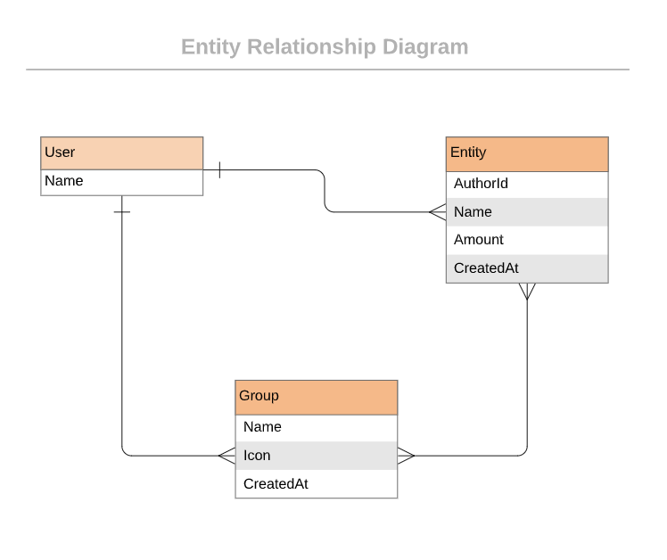
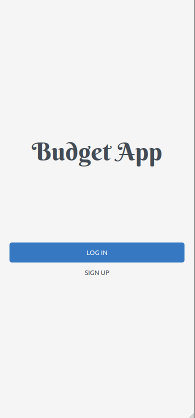

# Bug App

> The Ruby on Rails capstone project is about building a mobile web application where you can manage your budget: you have a list of transactions associated with a category, so that you can see how much money you spent and on what.

## Built With

- Rails, Ruby, Gems, rspec, SQL.

## Setup Project
- Clone repo by using (https://github.com/LuisSalas94/budget_app)
- Install dependencies with `bundle install`

## Usage
- Run with `rails server`

## Author

👤 **Fernando Salas**

- GitHub: [@Fernando Salas](https://github.com/LuisSalas94)
- LinkedIn: [Fernando Salas](https://www.linkedin.com/in/luisfernandosalasgave/)

**Live Demo**
- [Link](https://peaceful-beach-42485.herokuapp.com/)

## 🤝 Contributing

Contributions, issues, and feature requests are welcome!

Feel free to check the [issues page](https://github.com/Santiago220991/Recipe-App/issues).

## Show your support

Give a ⭐️ if you like this project!

## Acknowledgments

- Original design idea by [Gregoire Vella](https://www.behance.net/gregoirevella) on Behance.

## 📝 License
This project is [MIT](https://opensource.org/licenses/MIT) licensed.
